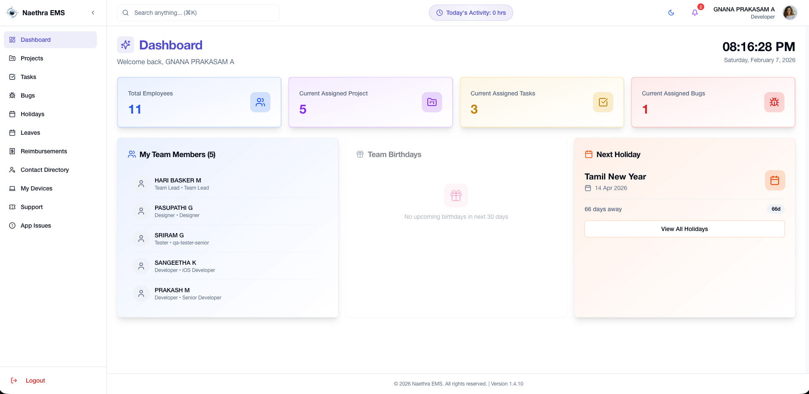
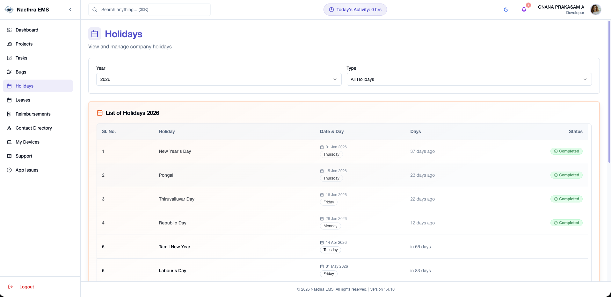
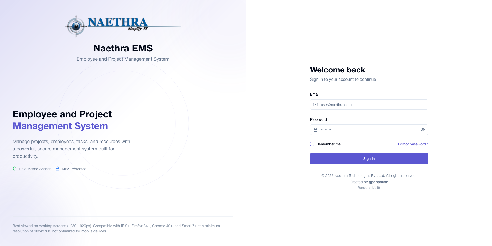

# Naetha EMS 2026

## Dashboard


## Holidays


## App Example


## Technologies Used

This project is built with:

- Vite
- TypeScript
- React
- shadcn-ui
- Tailwind CSS

## How can I edit this code?

The only requirement is having Node.js & npm installed - [install with nvm](https://github.com/nvm-sh/nvm#installing-and-updating)

Follow these steps:

```sh
# Step 1: Clone the repository using the project's Git URL.
git clone https://github.com/gpdhanush/naetha-ems-2026.git

# Step 2: Navigate to the project directory.
cd naetha-ems-2026

# Step 3: Install the necessary dependencies.
npm i

# Step 4: Start the development server with auto-reloading and an instant preview.
npm run dev
```

## GitHub Repository

[https://github.com/gpdhanush/naetha-ems-2026.git](https://github.com/gpdhanush/naetha-ems-2026.git)
